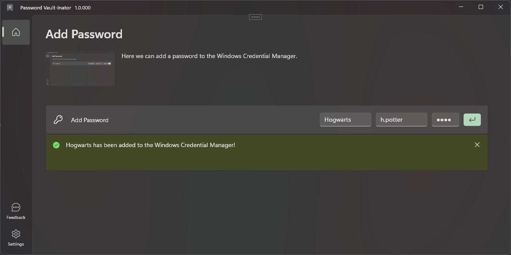

# Password Vault Inator
A simple WinUI 3 application to add passwords inside the Windows Credential Manager.

### Dependencies
- **[DevWinUI](https://github.com/ghost1372/DevWinUI)**
- **[Windows Community Toolkit](https://github.com/CommunityToolkit/Windows)**
- **[Microsoft Windows SDK BuildTools](https://www.nuget.org/packages/Microsoft.Windows.SDK.BuildTools/10.0.26100.6584?_src=template)**
- **[Windows App SDK](https://github.com/microsoft/WindowsAppSDK)**
- **[WinUIEx](https://github.com/dotMorten/WinUIEx)**
